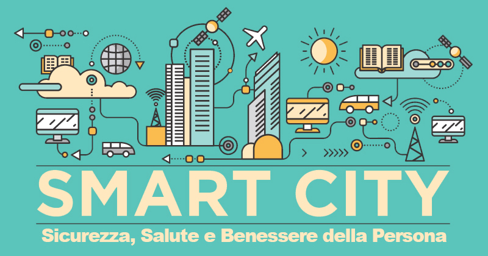

  

#

Noi alunni della 4ᵃ A informatica dell’ ITIS Ettore Majorana abbiamo preparato
il seguente lavoro riguardo la Salute e il Benessere, ma cosa si intende per
questo termine all’apparenza così semplice? La Conferenza Internazionale della
Sanità (New York, 1946) e l’Organizzazione Mondiale della Sanità (OMS)
definiscono la salute come "uno stato di completo benessere fisico, mentale,
sociale e non consiste soltanto nell’assenza di malattie o infermità. Il
possesso del migliore stato di sanità che si possa raggiungere costituisce uno
dei diritti fondamentali di ciascun essere umano, qualunque sia la sua razza,
la sua religione, le sue opinioni politiche, la sua condizione economica e
sociale. I Governi hanno la responsabilità della sanità dei loro popoli: essi
per farvi parte devono prendere le misure sanitarie e sociali appropriate."
Parlando di salute e benessere, abbiamo trattato di come queste facciano parte
dell’Agenda 2030, del loro legame con l’Illuminismo, le Città del Futuro, Le
Smart City, la religione e, ovviamente, lo sport.

## [Salute e Benessere](https://www.youtube.com/watch?v=m4sjGouK8Dk)

L’Agenda 2030 per lo Sviluppo Sostenibile è un programma d’azione per le
persone, il pianeta e la proprietà. Essa ingloba 17 Obiettivi per lo Sviluppo
Sostenibile, in un grande programma di azione per un totale di 169 traguardi.
Gli Obiettivi per lo Sviluppo, rappresentano obiettivi comuni su un insieme di
questioni importanti per lo sviluppo: “Obiettivi Comuni” significa che nessuno
ne è escluso. Per raggiungere lo Sviluppo Sostenibile, è fondamentale
garantire una vita sana e promuovere il benessere di tutti a tutte le età.
Sono necessari molti sforzi per sradicare completamente un’ampia varietà di
malattie e affrontare numerose e diverse questioni relative alla salute, siano
esse recenti o persistenti nel tempo. Gli obiettivi del target 3, sul quale si
basa questo articolo, riguardano, appunto, la salute e il benessere degli
individui. [L’Obiettivo
3](https://asvis.it/goal-e-target-obiettivi-e-traguardi-per-il-2030/) conta di
ridurre il tasso di mortalità materna globale; mettere fine alle morti di
neonati e bambini sotto i 5 anni; porre fine alle pandemie di AIDS,
tubercolosi e malattie trascurate; ridurre la mortalità da malattie non
trasmissibili attraverso la prevenzione e la cura e promuovere la salute
mentale e il benessere; rafforzare la prevenzione en il trattamento di abusi
di sostanze; dimezzare il numero di decessi a livello mondiale e le lesioni da
incidenti stradali; garantire l’accesso universale ai servizi di assistenza
sanitaria universale; ridurre sostanzialmente il numero di decessi e malattie
da sostanze chimiche pericolose e da inquinamento di aria, acqua e suolo;
sostenere la ricerca e lo sviluppo di vaccini e farmaci per le malattie
trasmissibili e non trasmissibili che colpiscono soprattutto i paesi in via di
sviluppo; aumentare sostanzialmente il finanziamento della sanità e il
reclutamento, lo sviluppo. La formazione e il mantenimento del personale
sanitario nei paesi in via di sviluppo; rafforzare la capacità di tutti i
paesi, per la prevenzione e la gestione dei rischi per la salute nazionale e
globale, e tutto ciò entro l’anno 2030.

## [Età dei lumi](https://www.treccani.it/enciclopedia/l-eta-dei-lumi-le-scienze-della-vita-l-epidemiologia-e-la-medicina-di-stato_%28Storia-della-Scienza%29/)

L’età dei lumi - L’illuminismo è il più importante movimento intellettuale
dell’Europa del 700, esprime la convinzione che l’uomo deve essere illuminato
cioè guidato dalla luce della ragione. L’illuminismo ha origine in Inghilterra
nel fine 600 dal filosofo John Locke (1632-1704), si sviluppò intensamente in
Francia, dal 630 al 700.Secondo Venturi l’Illuminismo raggiunse il suo massimo
splendore nel 1763 con la fine delle guerre e terminò nel 1789 con la
rivoluzione francese e questa è l’epoca della primavera dei lumi. La
centralità della ragione. La caratteristica dell’Illuminismo fu la fiducia
della ragione ciò che tutti gli uomini hanno e che consente loro di risolvere
i problemi, non si tratta di una fiducia cieca: alcuni illuministi riconobbero
l’importanza del sentimento. Gli Illuministi respinsero la filosofia razionale
di Cartesio che pretendeva di fare della ragione l’unica fonte della
conoscenza umana: al contrario riconobbero che la ragione andava applicata
all’esperienza secondo il metodo della scienza sperimentale di Galileo e
Newton.

- **Teorie del contagio**:

verso la fine del XVII sec. si era manifestato tra i medici un rinnovato
interesse per l'osservazione della Natura e la raccolta di dati in seguito
alla diffusione del metodo induttivo di Francis Bacon (1561-1626),
all'esperienza di una serie di disastrose epidemie, delle quali la patologia
umorale non riusciva a rendere ragione, e alla disponibilità di nuovi
strumenti matematici, come i logaritmi, inventati da John Napier (1550-1617).
Economisti, scienziati e riformatori sociali si impegnarono nella ricerca di
nuove interpretazioni e soluzioni dei fenomeni naturali e politici. In
Inghilterra, personaggi come John Graunt, William Petty, Edmond Halley, Thomas
Sydenham e Robert Hooke dedicarono la loro attenzione allo studio degli
archivi civili e delle condizioni climatiche; i loro sforzi congiunti
portarono a un perfezionamento delle teorie del contagio e della 'costituzione
epidemica', ossia dell'influenza delle condizioni miasmatiche e atmosferiche.

- **Inoculazione e vaccinazione**:

il vaiolo era una delle malattie più temute nel XVIII sec. ed era considerato
un fatto comune e normale, una tappa ineludibile del processo di crescita e di
invecchiamento. Nessuno sembrava poter sfuggire alle devastazioni che questa
malattia produceva nel corso normale dell'esistenza e tutti vivevano
nell'attesa terrorizzante di una sua visita. Non si disponeva di nessuna cura
efficace contro il vaiolo, cura che non esiste neppure oggi, a parte la
somministrazione di antibiotici per combattere le infezioni secondarie. La
cura tradizionale, basata sulla patologia umorale elaborata dal medico arabo
al-Rāzī (m. 925), al quale generalmente si attribuisce la prima descrizione
accurata del morbillo e del vaiolo, era basata su un trattamento 'caldo' e
‘rosso'. Essa consisteva infatti nella somministrazione di bevande speziate
calde e di dosi segrete di triaca per favorire la traspirazione; il paziente
veniva tenuto costantemente a letto, sotto una pesante coltre di coperte di
lana e di imbottite, perfino d'estate, per produrre la massima sudorazione.

- **Igiene pubblica e medicina di Stato**:

nella seconda metà del XVIII sec., l'influsso esercitato sia dal cosiddetto
tournant des mentalités sia dall'assolutismo illuminato convinse le autorità
politiche di alcuni Stati europei a fare un passo in avanti per migliorare il
benessere della popolazione, adottando le misure necessarie a combattere le
malattie epidemiche. Il problema più urgente era quello di favorire la
creazione di condizioni di vita e di lavoro più salubri, in base al principio
secondo cui il primo dovere di uno Stato era quello di assicurare ai sudditi
il più alto livello di benessere e di sicurezza possibile. In concreto ciascun
governante interpretava a modo suo questo programma e decideva, con l'aiuto
dei suoi consiglieri, come raggiungere l'obiettivo. Gli obblighi del sovrano
verso i propri sudditi erano rappresentati in modo analogo a quelli di un
padre verso i suoi figli. Inoltre, dato che l'autorità dei monarchi era
fondata sul diritto divino, essi erano tenuti a comportarsi con i sudditi con
la stessa benevolenza dimostrata da Dio nei confronti dell'umanità. Perfino il
più illuminato dei principi, tuttavia, si raffigurava il suo popolo come un
soggetto passivo della benigna sollecitudine del governo, che si esprimeva
nella consultazione degli esperti e nell'adozione delle misure ritenute più
opportune. L'idea di domandare ai propri sudditi di cosa avessero bisogno, o
quali aspetti della loro esistenza avrebbero voluto migliorare, era del tutto
estranea alla filosofia dell'assolutismo illuminato.

## [Le città del futuro](https://youtu.be/pik1DL2gyl8)

La smart city è una città che gestisce le risorse in modo intelligente, mira a
diventare economicamente sostenibile ed energeticamente autosufficiente, ed è
attenta alla qualità della vita e ai bisogni dei propri cittadini. La smart
city inoltre presenta alcune caratteristiche per essere chiamata tale:

- **Smart People**:
  gli abitanti di una città sono enormemente coinvolti nel processo di
  raggiungimento dell’obiettivo Smart city. Infatti, all’interno di una città
  intelligente si applica la politica partecipativa: tutti gli individui sono
  coinvolti all’interno dei processi decisionali e condividono idee, pensieri
  e informazioni.

- **Smart Living**:
  tutti i cittadini di una Smart city devono poter godere di un livello di
  salute, educazione, sicurezza e cultura elevati. Tutti i servizi devono
  essere facilmente accessibili a livello collettivo e devono essere in grado
  di garantire una qualità di vita elevata.

- **Smart Economy**:
  l’economia e il commercio all’interno di una città intelligente devono
  essere rivolti all’aumento della produttività nel rispetto delle risorse
  offerte dall’ambiente circostante. Anche l’occupazione all’interno della
  città è un fattore fondamentale: l’economia deve puntare sulla condivisione
  e sull’innovazione.

- **Smart Mobility**:
  anche la mobilità diventa intelligente all’interno delle Smart cities: si
  privilegiano forme di mobilità sostenibili, condivise e accessibili, quali
  sharing mobility e mobilità elettrica. Il fine ultimo è ottimizzare il mondo
  dei trasporti rendendoli accessibili ed economici.

- **Smart Enviroment**:
  alla base dello sviluppo di una città intelligente deve esserci lo sviluppo
  sostenibile: rispetto dell’ambiente circostante, utilizzo corretto delle
  risorse naturali ed efficienza energetica sono gli obiettivi da raggiungere.

## [Smart city in Italia](https://www.economyup.it/mobilita/smart-city-cosa-sono-davvero-e-a-che-punto-siamo-in-italia/)

Smart City è un termine ormai diventato di moda. E, anche se a volte viene
utilizzato impropriamente come leva di marketing da aziende e amministrazioni
locali, si riferisce all’ideale collettivo della città del futuro. Ma vediamo
qual è il vero significato di “smart city” o città intelligente. Una smart
city è un’area urbana in cui, grazie all’utilizzo delle tecnologie digitali e
più in generale dell’innovazione tecnologica, è possibile ottimizzare e
migliorare le infrastrutture e i servizi ai cittadini rendendoli più
efficienti. Tra i punti fondamentali e le [caratteristiche
principali](https://www.lumi4innovation.it/smart-city-cose-come-funziona-caratteristiche-ed-esempi-in-italia/)
di una città intelligente, troviamo infatti:

- **Partecipazione e responsabilità condivisa**:
  informazione e comunicazione sono fondamentali per permettere ai cittadini
  di interagire, dialogare e partecipare allo sviluppo della città e alle
  decisioni dell’amministrazione locale. Per questo motivo la città
  intelligente deve potersi appoggiare a un sistema informatico che permetta a
  chiunque di inviare in tempo reale una segnalazione su un problema o una
  richiesta. Il primo fondamento della smart city è quindi di essere inclusiva
  e massimizzare il capitale umano e sociale anche attraverso azioni volte a
  promuovere lo sviluppo delle attività e del commercio in città.

- **Smart building o edifici intelligenti**:
  gli edifici di nuova costruzione o che subiscono un intervento di
  riqualificazione devono rispondere a precisi standard di efficienza
  energetica e smartness. Lo smart building è il tassello fondamentale per la
  costruzione di una smart city e fa parte del capitale infrastrutturale e
  sociale.

- **Efficienza energetica e sostenibilità ambientale**:
  per gestire in modo efficiente l’energia e ottenere risultati di risparmio
  energetico bisogna puntare alla creazione di una smart grid o di sistemi di
  smart energy. Una città intelligente deve anche puntare sull’uso delle
  energie rinnovabili e su sistemi intelligenti di gestione dei rifiuti in
  un’ottica di economia circolare. Importante anche il ruolo delle aree verdi
  e dei parchi, perché anche il capitale ambientale va ottimizzato e reso
  efficiente.

- **Sicurezza Integrata**:
  in una città intelligente, la sicurezza è un aspetto importantissimo.
  Sicurezza significa minore criminalità e maggiore attenzione alle aree
  critiche come le periferie ad esempio. L’utilizzo di tecnologie innovative e
  sistemi di sicurezza sempre più interconnessi e integrati permette di
  raggiungere risultati importanti in questo ambito.

- **Trasporto e mobilità**:
  smart mobility, e-mobility ma anche soluzioni di smart parking. Perché una
  città sia efficiente, più vivibile e intelligente, bisogna andare verso
  soluzioni che snelliscano il traffico e riducano l’inquinamento.

## [The City of the Future](https://youtu.be/L054Xd97_rk)

When people talk about **smart cities** and the technologies that would make
them so, the edge between actually-possible solutions and science-fiction
ideas is often not very clear, even though the speed of technology development
is only getting faster. [Elon Musk](https://www.wikiwand.com/en/Elon_Musk) is
a nerdy CEO who strives to think about exciting-yet-realistic technologies
(and, in general, solutions to problems). The [linked
video](https://youtu.be/L054Xd97_rk) shows some of his ideas and why he
believes those make sense, including:

- **Reusable rockets as cheap as ordinary aircrafts and capable of
  transporting people or cargo from city to city**:
  rockets would allow us to fly from New York City to Shangai in 39 minutes or
  Sidney to London in 59 minutes. If we didn't reuse planes, it would cost up to
  $250.000.000 to fly one way, but because we reuse them tens of thousands of
  times, it becomes affordable. That also applies to rockets! A
  [SpaceX](https://www.spacex.com) rocket costs about $60.000.000, if we could
  reuse it 1000 times, it would then costs $60.000 per flight and by carrying a
  number of people, we could get the cost of a rocket flight down to the price
  of an economy aircraft ticket.
- **Hyperloop**: another way of getting people from city to city would be via
  [hyperloop](https://www.wikiwand.com/en/Hyperloop). When we think about the
  ideal transportation system, we would want something that

  - costs half the price,
  - is twice as fast,
  - can't crash,
  - is immune to the weather,
  - and is powered by solar panels,

  so hyperloop would be a very good deal.

- **Electric self-driving land vehicles**: [self-driving
  cars](https://www.tesla.com/autopilot)' state of the art [is already more
  advanced than we may think](https://youtu.be/zRnSmw1i_DQ).

  - Your self-driving car wouldn't have sit in the parking lot waiting for
    you, it could go back out by itself, and could even make money for you by
    picking up passengers and dropping them off (with the possibility to
    schedule when it can be shared, or even with whom, and when you want it
    ready for yourself).
  - [Autonomous electric semi-trucks](https://www.tesla.com/semi) would make
    transportation cheaper and would be very good for the environment as 23%
    of greenhouse gas comes from the trucking industry.
  - Most people would imagine cars and drones flying around in a futuristic
    city but this isn't realistic to Elon, since flying cars would be noisy,
    produce a lot of wind, have a number of safety issues and be affected by
    the weather. Instead, Elon thinks [self-driving tunnel
    networks](https://www.boringcompany.com) would be a much better options.
    We have 3D city buildings but road networks that are mostly distributed on
    only one level. Elon believes that the solution to urban traffic is a
    [network of tunnels](https://youtu.be/u5V_VzRrSBI) that go deep under our
    cities since we can always go deeeper than we can go upward.

- **Gamified learning**:
  you may think that this has nothing to do with smart cities at first, but
  ask yourself the question "how should kids and adults spend their time in
  the city of the future, where there are fewer and fewer jobs that robots
  can't do better than us?" Elon says that a universal income will be
  necessary and schools shouldn't make kids go through different grades like
  an assembly line since children have different abilities. Schools should
  instead gamify the learning experience and focus on teaching problem
  solving, ethics and, in general, things that allow one to create and
  understand or predict the future.

Even if people are already working hard on almost all of these astonishing
technologies, we're not ready yet. So, now we described the city of **the
future**, but let's also take a look at the smartest city of **today**,
[London](https://www.forbes.com/sites/iese/2020/07/08/these-are-the-10-smartest-cities-in-the-world-for-2020).

As one of the world’s great cities, London has evolved over centuries to
deliver the housing, transport and infrastructure it needs. Against a global
backdrop of accelerating urbanisation and revolutionary digital
transformation, the Mayor has set out his ambition to make London the world’s
smartest city. Today, London is already a hub for smart mobility, cleantech,
proptech and govtech, with many more opportunities for further cross-sectoral
development in this capital of convergence, here is why:

- **The future of transport**:
  London is a leader in smart mobility, with an ambitious goal that by 2041,
  80% of journeys in the capital will be made on foot, on a bicycle, or on
  public transport. The city’s transport agency – Transport for London, also
  has a unique and ambitious approach to innovation, as exemplified in the
  London RoadLab initiative.
- **A cleantech leader with market potential**:
  the Mayor of London wants to ensure London is a zero-carbon city by 2050.
  The value of London’s low carbon goods and services sector was worth £39.7bn
  in 2017/18, having grown by more than nine percent over the last two years
  and expected to continue at more than seven percent to 2021/22.

  Find out more about [London's cleantech
  sector.](https://www.business.london/invest/sectors/urban/cleantech)

- **Where real estate meets tech**:
  as the largest commercial real estate investment market in the world and
  home to a globally-renowned tech centre, it’s no surprise that London is a
  hotbed for proptech.

  From dedicated accelerators and incubators, such as [Pi
  Labs](https://pilabs.co.uk/) and [Geovation](https://geovation.uk/), to
  London success stories (think [Zoopla](https://www.zoopla.co.uk/) and
  [Purplebricks](https://www.purplebricks.co.uk/)), the capital is building
  the foundations for an exciting future.

  Find out more about [London's proptech
  sector.](https://www.business.london/invest/sectors/urban/proptech)

- **Accessible, responsive, citizen-oriented public services**:
  London is transforming its public services to better meet the needs of its
  citizens. The city has long been recognised as a leader in mobilising open
  data for public benefit, as evidenced through the London Datastore and
  Transport for London’s open data policy.

  The London Office of Technology & Innovation (LOTI) is set to build common
  capability and drive the opportunity to collaborate and scale digital
  innovation across the capital’s local authorities.

## [Sport e sedentarietà](https://www.youtube.com/watch?v=5diDs3NRRco)

> Un mondo tecnologico per lo sport

Sappiamo tutti come l’attività sportiva sia un bene per tutti, ci aiuta a
stare bene fisicamente e mentalmente. Ma con l’avvento delle nuove tecnologie
il mondo dello sport, soprattutto dai giovani viene sempre più messo da parte.
Per dare spazio ad una vita sedentaria. Dove ci si accantonerà sempre di più
fino ad arrivare a livelli estremi, la tecnologia nel mondo dello sport sta
comunque facendo fare passi da gigante a livello competitivo, basta pensare
alla palla volo dove ci sono i computer che guardano al millimetro se la palla
è stata toccata o meno, oppure nel calcio con il var per avere sempre di più
margini di errori minimi, in pochissime parole: la tecnologia per lo sport sta
diventando essenziale, bisogna trovare il giusto compromesso, a livello
personale non bisognerà mai abbandonare se stessi per una partita ai
videogiochi, e per lo sport a livello competitivo beh, solo il tempo saprà
rispondere se le nuove tecnologia hanno aiutato o meno.

## [Religione e benessere](https://youtu.be/PB7SWg2I1zI)

Qual è il rapporto tra religione e benessere? A questa domanda risponde in
maniera esaustiva la seconda edizione dell'_Handbook of Religion and Health_,
curato dallo psichiatra statunitense Harold Koenig. Per anni psicologia e
religione sono state contrapposte, ed è un vero peccato, perché la religione
influenza positivamente la nostra psiche, quindi anche la salute. Bisogna
prendere atto del fatto che la religione fa bene alla salute, secondo recenti
studi, infatti, chi non ha un credo ha meno probabilità di essere sano e
felice e tenderebbe a perdere almeno sette anni di vita. Ogni fedele, specie
se vive in un contesto geografico molto diverso da quello in cui le regole
alimentari hanno avuto origine, cercherà il proprio modo di interpretare le
norme, più o meno supportato dalle comunità di correligionari. Garantire a
tutti gli esseri umani che vivono stabilmente in un territorio la possibilità
di adeguare i propri comportamenti alimentari alle norme alimentari previste
dal proprio credo è una sfida che la nostra società ha iniziato da poco ad
affrontare con consapevolezza.

#

> #### Prodotto finale dell'UDA
>
> > #### Classe 4ᵃ A informatica
> >
> > Anno scolastico 2020/2021
